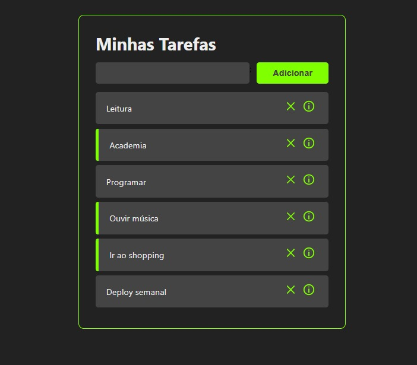

# Lista de Tarefas

## Rodando o projeto

### `yarn install`

### `yarn start`

## Descrição do Projeto
 

Aplicativo realizado para armazenar tarefas a serem feitas de maneira totalmente intuitiva e rápida!

<h1 align="center">
    <a href="https://pt-br.reactjs.org/">🔗 React</a>
</h1>

 

### Features

- [x] Cadastro de atividade
- [x] Marca de atividade foi concluída
- [x] Excluir atividade
- [x] Ver mais detalhes sobre a atividade
